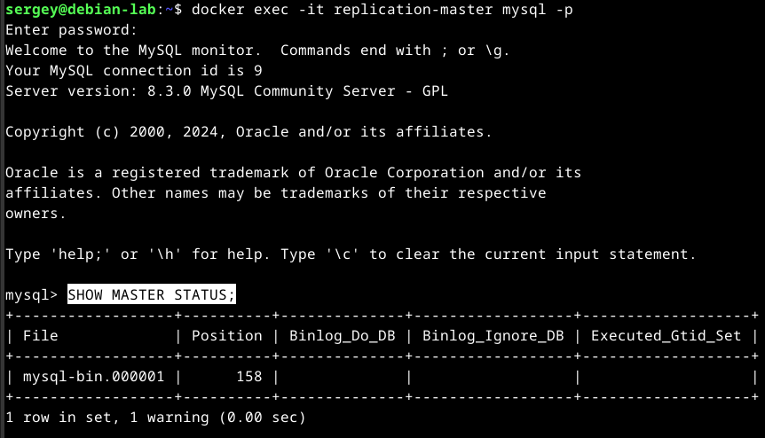
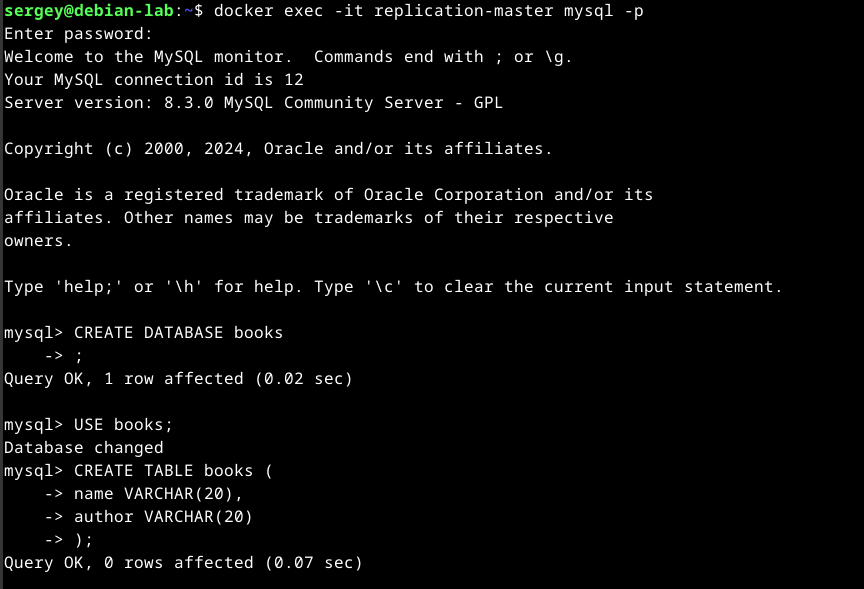

# Домашнее задание к занятию «Репликация и масштабирование. Часть 1». Потапчук Сергей.

### Инструкция по выполнению домашнего задания

1. Сделайте fork [репозитория c шаблоном решения](https://github.com/netology-code/sys-pattern-homework) к себе в Github и переименуйте его по названию или номеру занятия, например, https://github.com/имя-вашего-репозитория/gitlab-hw или https://github.com/имя-вашего-репозитория/8-03-hw).
2. Выполните клонирование этого репозитория к себе на ПК с помощью команды `git clone`.
3. Выполните домашнее задание и заполните у себя локально этот файл README.md:
   - впишите вверху название занятия и ваши фамилию и имя;
   - в каждом задании добавьте решение в требуемом виде: текст/код/скриншоты/ссылка;
   - для корректного добавления скриншотов воспользуйтесь инструкцией [«Как вставить скриншот в шаблон с решением»](https://github.com/netology-code/sys-pattern-homework/blob/main/screen-instruction.md);
   - при оформлении используйте возможности языка разметки md. Коротко об этом можно посмотреть в [инструкции по MarkDown](https://github.com/netology-code/sys-pattern-homework/blob/main/md-instruction.md).
4. После завершения работы над домашним заданием сделайте коммит (`git commit -m "comment"`) и отправьте его на Github (`git push origin`).
5. Для проверки домашнего задания преподавателем в личном кабинете прикрепите и отправьте ссылку на решение в виде md-файла в вашем Github.
6. Любые вопросы задавайте в чате учебной группы и/или в разделе «Вопросы по заданию» в личном кабинете.

Желаем успехов в выполнении домашнего задания.

---

### Задание 1

На лекции рассматривались режимы репликации master-slave, master-master, опишите их различия.

*Ответить в свободной форме.*

### Решение

В режиме master-master используются два равноправных инстанса и в любой из них можно записывать данные, которые будут реплицированы на другой master. При использовании режима master-slave запись производится только на мастер и репликация данных происходит только в одну сторону, с мастера на слейв.

---

### Задание 2

Выполните конфигурацию master-slave репликации, примером можно пользоваться из лекции.

*Приложите скриншоты конфигурации, выполнения работы: состояния и режимы работы серверов.*

### Решение

1. Поднимем два контейнера в одной сети

```Bash
docker network create replication
docker run -d --name replication-master --network replication -e MYSQL_ROOT_PASSWORD=123456 mysql:8.3
docker run -d --name replication-slave --network replication -e MYSQL_ROOT_PASSWORD=123456 mysql:8.3
```


2. Добавим мастеру пользователя для слейва, дадим ему права и проверим

```Bash
docker exec -it replication-master mysql -p
```

```sql
CREATE USER 'replication'@'%';
GRANT REPLICATION SLAVE ON *.* TO 'replication'@'%';
SHOW GRANTS FOR replication@'%';
```


3. Настрим мастер. Скопируем файл /etc/my.cnf из контейнера, отредактируем, отправим обратно, перезапустим контейнер и проверим статус мастера.

```bash
docker cp replication-master:/etc/my.cnf ./
nano my.cnf
```

```
# добавим в секцию [mysqld]
server_id = 1
log_bin = mysql-bin
```

```Bash
docker cp my.cnf replication-master:/etc/
docker exec -it replication-master mysql -p
```

```sql
SHOW MASTER STATUS;
```



4. Настроим реплику таким же образом /etc/my.cnf

```
docker cp replication-slave:/etc/my.cnf ./
nano my.cnf
```

```
# добавим в секцию [mysqld]
server_id = 2
read_only = 1
```

```Bash
docker cp my.cnf replication-slave:/etc/
docker restart replication-slave
docker exec -it replication-slave mysql -p
```


```sql
CHANGE MASTER TO
    MASTER_HOST='replication-master',
    MASTER_USER='replication';
START SLAVE;
SHOW SLAVE STATUS;
```


5. Проверяем.




---

## Дополнительные задания (со звёздочкой*)
Эти задания дополнительные, то есть не обязательные к выполнению, и никак не повлияют на получение вами зачёта по этому домашнему заданию. Вы можете их выполнить, если хотите глубже шире разобраться в материале.

---

### Задание 3* 

Выполните конфигурацию master-master репликации. Произведите проверку.

*Приложите скриншоты конфигурации, выполнения работы: состояния и режимы работы серверов.*

### Решение

1. Подниму [проект](mysql_repl_master_master) через docker-compose

```Bash
docker compose up -d
```

2. Проверка


